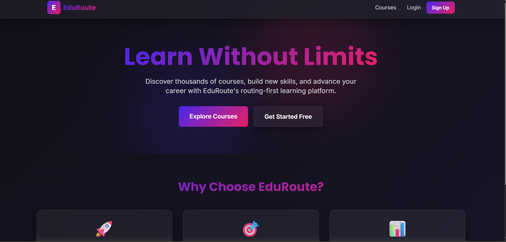
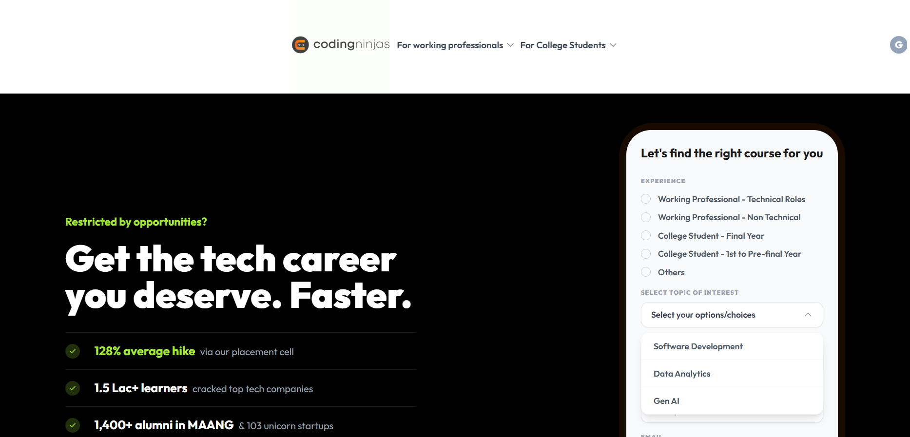

# Qskill-project
# Qskill-projects

1.TransLingo-
A professional full-stack translation application for translating English to Indian languages with user authentication, translation history, and favorites.

2.TaskFocus-
A React app that generates random strings with customizable options using **useState**, **useCallback**, and **useEffect** hooks.full-stack productivity platform that helps users manage tasks, track focus sessions with a Pomodoro timer, and analyze their productivity. The project demonstrates modern web development practices with React hooks, RESTful API design, and MySQL database integration.

3.EduRoute-
A React app demonstrating **client-side routing** using **react-router-dom** to create multiple pages without page reloads.A routing-first e-learning platform built with React, Node.js, Express, and MySQL. Features advanced UI/UX with glassmorphism, animations, and comprehensive routing architecture.

4.Coding-ninjas_clone-
This is a **full-stack web application** that clones the Coding Ninjas platform. It combines a **React frontend** with an **Express.js backend** and **SQLite database** to create a complete learning management system.

